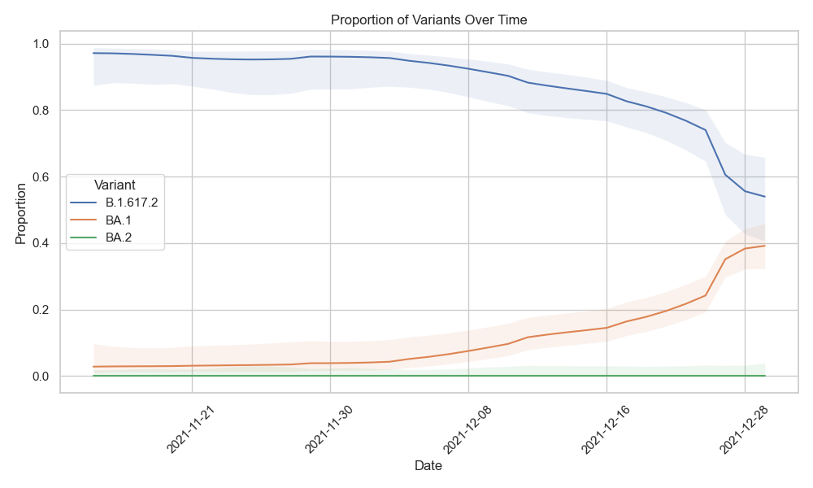

---
jupyter:
  jupytext:
    cell_metadata_filter: -all
    formats: md
    text_representation:
      extension: .md
      format_name: markdown
      format_version: '1.3'
      jupytext_version: 1.16.4
  kernelspec:
    display_name: Python 3
    language: python
    name: python3
---

# SARS-CoV-2 Wastewater Surveillance Tutorial

The occurence of SARS-CoV-2 in wastewater can be used as an early warning system for the presence of the virus in a community. The virus is shed in the stool of infected individuals, and can be detected in wastewater before clinical cases are reported. This can be particularly useful for monitoring the presence of new variants of the virus, which may be more transmissible or resistant to vaccines. To monitor occurrence of SARS-CoV-2 variants in waste water, the RNA of the virus is amplified with PCR, and the viral genome is sequenced to identify specific mutations that are characteristic of different variants. This tutorial introduces the type of analysis that is required to translate raw sequencing data into epidemiological information as part of the [national surveillance program of SARS-CoV-2 variants in wastewater](https://cov-spectrum.ethz.ch/story/wastewater-in-switzerland).

The data for this tutorial is from {cite}`bagutti_wastewater_2022`.

## Setting up your work directory

The tutorial assumes that you have installed V-pipe using the [quick install installation documentation](quick-install-v-pipe-and-conda), and that the workflow is setup with the following structure:

```text
vp-analysis
├── V-pipe
├── mambaforge
└── work
```

- `vp-analysis` is the main directory where you have installed V-pipe
- `V-pipe` is the directory with V-pipe's own code
- `mambaforge` has dependencies to start using V-pipe (bioconda, conda-forge, mamba, snakemake)
- `work` is the directory where you have performed the test analysis

## Preparing the input data

In addition to the raw sequencing data (`fastq.gz`) files, we also need to provide information about the SARS-CoV-2 variants we would like to detect. For this tutorial all required input files are provided in the correct format. This set up can serve as an example for your own data. 

### Set up the working directory

We provide the test data for this tutorial as a tarball that you can download and extract and will result in a directory called `work_cowwid`:

```bash
cd vp-analysis/

wget https://vpipe-gsod.s3.eu-central-1.amazonaws.com/cowwid_tutorial.tar.gz
tar -xvf cowwid_tutorial.tar.gz
```

This will download and create a directory with files that you would need to provide. More information about how to set this up for your own data can be found at [organizing data](organizing-data). 

After preparing the input files, you can initiate the project with:

```bash
cd work_cowwid
../V-pipe/init_project.sh
```

The above two steps will result in the following directory structure:

```text
work_cowwid
├── config.yaml
├── deconv_linear_logit_quasi_strat.yaml
├── samples
│   └── sample1
│       ├── 2021-11-15
│       │   └── raw_data
│       │       ├── Ba210453_2021-11-15_R1.fastq
│       │       └── Ba210453_2021-11-15_R2.fastq
│       ├── ...
│       |
│       ├── 2021-12-28
│       │   └── raw_data
│       │       ├── Ba210487_2021-12-28_R1.fastq
│       │       └── Ba210487_2021-12-28_R2.fastq
│       └── 2021-12-29
│           └── raw_data
│               ├── Ba210488_2021-12-29_R1.fastq
│               └── Ba210488_2021-12-29_R2.fastq
├── samples.tsv
├── timeline.tsv
└── vpipe
```

In addition to the raw fastq files, we have prepared `samples.tsv`, `timeline.tsv` (more about `timeline.tsv` [later](timeline-lollipop)) and the deconvolution configuration file: `deconv_linear_logit_quasi_strat.yaml`. Here are the first few lines of `samples.tsv`:

```
sample1	2021-11-15	251	v41
sample1	2021-11-16	251	v41
sample1	2021-11-17	251	v41
sample1	2021-11-18	251	v41
```

Note that `samples.tsv` contains the read length in the third column and the protocol used for PCR amplification and sequencing in the fourth column. The identifier `v41` depicts that our raw fastq files were generated according to the ARTIC V4.1 nCov-2019 primers. The required information for this primer set is part of the V-pipe repository, and can be found in [resources/sars-cov2/primers/v41](https://github.com/cbg-ethz/V-pipe/tree/master/resources/sars-cov-2/primers/v41).

### Prepare Variant of Concern (VOC) data

V-pipe requires the information for each variant to be stored in a specific yaml format. The yaml file consists at least of two parts: the variant information and the list of mutations that are characteristic of the variant. The following is a minimal (and shortened) example of the yaml file for the delta variant:

```yaml
variant:
  voc: 'VOC-21APR-02'
  who: 'delta'
  short: 'de'
  pangolin: 'B.1.617.2'
mut:
  210: 'G>T'
  241: 'C>T'
  3037: 'C>T'
  4181: 'G>T'
  6402: 'C>T'
```

These yaml files are available from the [COJAC GitHub repository](https://github.com/cbg-ethz/cojac/tree/master/voc) for most of the variants that are currently of interest. For our tutorial, we will download the yaml files for the delta, omicron BA.1, and omicron BA.2 variants. For this make a directory called `vocs` in your work directory (so in `work_cowwid`):

```bash
mkdir vocs
```

And download the yaml files for the delta, omicron BA.1, and omicron BA.2 variants:

```bash
cd vocs
wget https://raw.githubusercontent.com/cbg-ethz/cojac/master/voc/delta_mutations_full.yaml
wget https://raw.githubusercontent.com/cbg-ethz/cojac/master/voc/omicron_ba1_mutations_full.yaml
wget https://raw.githubusercontent.com/cbg-ethz/cojac/master/voc/omicron_ba2_mutations_full.yaml

```

These yaml files are used to define the mutations that are characteristic of the delta, omicron BA.1, and omicron BA.2 variants. The yaml files can also be created with the help of the COJAC tool, which queries the Cov-Spectrum database to identify the mutations that are characteristic of each variant. Follow the [preparing VOC configuration](prepare-voc-data) to learn how to use other resources to generate the yaml files for the delta, omicron BA.1, and omicron BA.2 variants.

## Run COJAC

The main feature of COJAC is to detect the presence of a certain variant based on the presence of a combination of mutations. In order to specify the input files and output charactertistics, let's change the `config.yaml` file:

```yaml
general:
    virus_base_config: 'sars-cov-2'

input:
    samples_file: samples.tsv
    variants_def_directory: vocs/

output:
    trim_primers: true
```

You can do this with the following command (but of course also by simply using copy-paste):

```bash
cat <<EOT > config.yaml
general:
    virus_base_config: 'sars-cov-2'

input:
    samples_file: samples.tsv
    variants_def_directory: vocs/

output:
    trim_primers: true
EOT
```

After setting the configuration, we can run V-pipe to do the preprocessing, and run COJAC to detect the presence of the variants:

```bash
cd ..
./vpipe --cores 8 allCooc results/cohort_cooc_report.v41.csv
```

This will generate several COJAC output files, including `results/cohort_cooc.v41.csv`, which contains the co-occurrence information for each sample, here's an example of the first few lines of the file:

| sample  	| batch      	| amplicon 	| frac       	| cooc 	| count 	| mut_all 	| mut_oneless 	| om2 	| de 	| om1 	|
|---------	|------------	|----------	|------------	|------	|-------	|---------	|-------------	|-----	|----	|-----	|
| sample1 	| 15.11.2021 	| 1        	| 1          	| 2    	| 184   	| 184     	| 1           	|     	| 1  	|     	|
| sample1 	| 15.11.2021 	| 30       	| 0.95049505 	| 2    	| 101   	| 96      	| 3           	|     	| 1  	|     	|
| sample1 	| 15.11.2021 	| 37       	| 0.9408284  	| 2    	| 169   	| 159     	| 7           	|     	| 1  	|     	|
| sample1 	| 15.11.2021 	| 73       	| 1          	| 2    	| 13    	| 13      	| 0           	|     	| 1  	|     	|
| sample1 	| 15.11.2021 	| 76       	| 1          	| 2    	| 15    	| 15      	| 64          	|     	| 1  	|     	|
| sample1 	| 15.11.2021 	| 78       	| 1          	| 2    	| 219   	| 219     	| 8           	|     	| 1  	|     	|

All columns are explained in the [COJAC documentation](https://github.com/cbg-ethz/cojac?tab=readme-ov-file#export-table-for-downstream-analysis):

 - **count**: total count of amplicons carrying the sites of interest
 - **mut_all**: amplicons carrying mutations on all site of interest (e.g.: variant mutations observed on all sites)
 - **mut_oneless**: amplicons where one mutation is missing (e.g.: only 2 out of 3 sites carried the variant mutation, 1 sites carries wild-type)
 - **frac**: fraction _(mut_all/count)_ or empty if no _counts_
 - **cooc**: number of considered site (e.g.: 2 sites of interests) or empty if no _counts_

 In the above example, we see that we have evidence of the delta variant in the sample from 15.11.2021 at amplicon 1, 30, 37, 73, 76, and 78.

## LolliPop

Now that we have evidence for the presence of variants, we can use [LolliPop](https://github.com/cbg-ethz/LolliPop) to answer the question: in which **relative proportions** are the variants in the water?

(timeline-lollipop)=
### Timeline

Because Lollipop performs a time-series analysis, we need to provide information on the date of sampling. In this tutorial we do this with  a timeline file. For more information and alternative methods see [Specifying timeline and location information](specifying-timeline-and-location-information). The timeline file should contain the date of each sample, and the location where the sample was taken. This file contains the same information as the `samples.tsv` file, but with the addition of the location of the sample. An example of `timeline.tsv` for the first few samples of our dataset would be:

```
sample	batch	reads	proto	location_code	date	location
sample1	2021-11-15	251	v41	Ba	2021-11-15	Basel (BS)
sample1	2021-11-16	251	v41	Ba	2021-11-16	Basel (BS)
sample1	2021-11-17	251	v41	Ba	2021-11-17	Basel (BS)
…
```

```{note}
Note that:

- The timeline tsv contains a header line (`samples.tsv` does not).
- In addition to the first four columns of `samples.tsv`, only `location` and `date` are necessary for LolliPop.
```

Now we need to provide the `timeline.tsv` file in `config.yaml` at `tallymut` under `timeline_file` and provide the deconvolution configuration. Add these lines to `config.yaml`:

```yaml
tallymut: 
    timeline_file: timeline.tsv

deconvolution:
    deconvolution_config: deconv_linear_logit_quasi_strat.yaml
```

You can do this with the following command (but of course also by simply using copy-paste):

```bash
cat <<EOT >> config.yaml

tallymut: 
    timeline_file: timeline.tsv

deconvolution:
    deconvolution_config: deconv_linear_logit_quasi_strat.yaml
EOT
```

### Run LolliPop

This command will run the deconvolution:

```bash
./vpipe --cores 8 deconvolution
```

### Visualizing the results

V-pipe will produce `results/deconvoluted.tsv.zst`, which is a Zstandard-compressed table that can be directly reads into pandas for further processing. We would like visualize that using python. First install the necessary packages:

```bash
cd ../../
# activate the base conda environment
. vp-analysis/*forge*/bin/activate ''

# create the environment
mamba create -n cowwid-plot -c conda-forge -c bioconda pandas matplotlib seaborn zstandard

# activate the environment
. vp-analysis/*forge*/bin/activate cowwid-plot
```

After installing you can use this python script that reads the deconvoluted table and plots the proportion of each variant over time.

```python
import pandas as pd
import matplotlib.pyplot as plt
import seaborn as sns

# read ../results/deconvoluted.tsv.zst into a pandas dataframe
df = pd.read_csv('vp-analysis/work_cowwid/results/deconvoluted.tsv.zst', sep='\t')

# Filter the DataFrame
df_filtered = df[df['variant'] != 'undetermined']

# Set the plot style
sns.set_theme(style="whitegrid")

# Create the plot
plt.figure(figsize=(10, 6))
for variant, group_data in df_filtered.groupby('variant'):
    plt.plot(group_data['date'], group_data['proportion'], label=variant)
    plt.fill_between(group_data['date'], group_data['proportionLower'], group_data['proportionUpper'], alpha=0.1)

# Customize the plot
plt.xlabel('Date')
plt.ylabel('Proportion')
plt.legend(title='Variant')
plt.xticks(rotation=45)
plt.gca().xaxis.set_major_locator(plt.matplotlib.dates.WeekdayLocator(interval=1))
plt.title('Proportion of Variants Over Time')
plt.tight_layout()

# save as png
plt.savefig('vp-analysis/work_cowwid/proportion_of_variants_over_time.png')

# Show the plot
plt.show()
```


